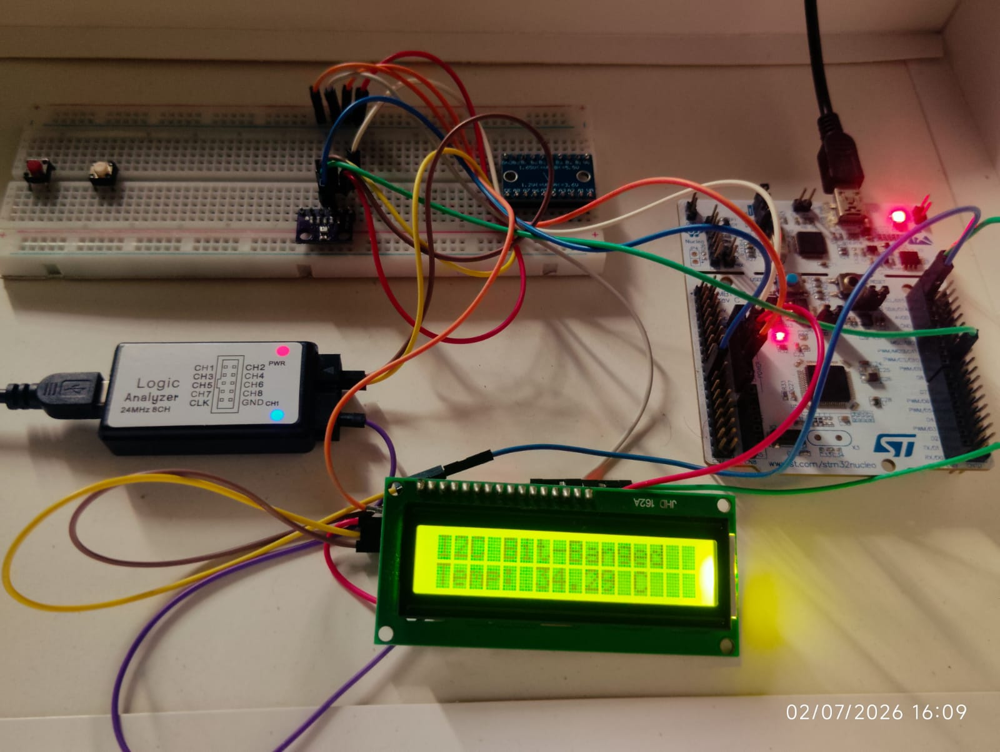
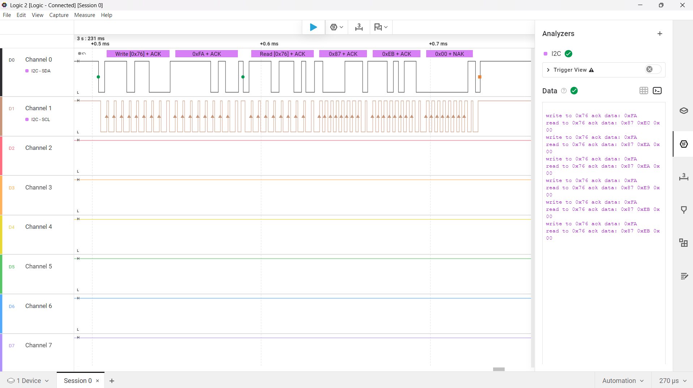
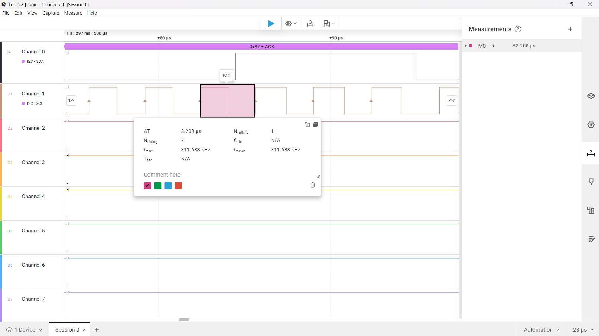

# I²C Bit Banging

Software implementation of the I²C (Inter-Integrated Circuit) protocol using **GPIO bit banging** on the **STM32 Nucleo-F446RE** without relying on the STM32 hardware I²C peripheral.

This project demonstrates how the I²C protocol operates at the bit level by manually generating START/STOP conditions, transmitting addresses, handling ACK/NACK, and performing register-level communication with the **BMP280 temperature and pressure sensor**. The acquired temperature data is displayed on an **I²C LCD**.

---

# Project Structure

```text
I2C/
│
├── Core/
│   ├── Inc/
│   │   ├── bmp280.h
│   │   ├── i2c_bitbang.h
│   │   ├── i2c_gpio.h
│   │   ├── i2c_lcd.h
│   │   └── main.h
│   │
│   └── Src/
│       ├── bmp280.c
│       ├── i2c_bitbang.c
│       ├── i2c_lcd.c
│       └── main.c
│
├── Drivers/
├── Images/
└── README.md
```

---

# Overview

The project implements a complete software I²C driver capable of communicating with external peripherals using only GPIO pins.

The driver was validated by communicating with the BMP280 sensor and displaying the measured temperature on an I²C LCD.

---

# Features

## Software I²C Driver

- START Condition
- STOP Condition
- Repeated START
- ACK / NACK Handling
- Address Transmission
- Register Read
- Register Write
- Multi-byte Register Read
- GPIO Open-Drain Implementation
- Software Timing Control

---

## BMP280 Driver

- Chip ID Verification
- Factory Calibration Read
- Sensor Configuration
- Temperature Measurement
- Pressure Register Access
- Compensation Data Parsing

---

## LCD Interface

- I²C LCD Driver
- Temperature Display
- Software I²C Communication

---

# Driver Architecture

```text
Application (main.c)

        │

        ▼

BMP280 Driver

        │

        ▼

Software I²C Driver

        │

        ▼

GPIO Control Layer

        │

        ▼

STM32 GPIO Hardware
```

---

# Hardware Used

- STM32 Nucleo-F446RE
- BMP280 Sensor
- I²C LCD (PCF8574)
- Logic Analyzer
- Breadboard
- Jumper Wires
- USB Cable

---

# GPIO Configuration

| Signal | STM32 Pin |
|---------|-----------|
| SDA | PB6 |
| SCL | PB7 |

GPIO Mode

- Open Drain Output
- Internal Pull-Up Enabled

---

# Hardware Setup



---

# Sensor Initialization

The BMP280 initialization sequence performs the following operations.

1. Read Chip ID
2. Verify Device
3. Read Factory Calibration Data
4. Configure Sensor
5. Wait for Sensor Stabilization
6. Start Temperature Measurement

---

# BMP280 Register Access

The following registers are accessed during initialization.

| Register | Address | Purpose |
|----------|----------|----------|
| CHIP_ID | 0xD0 | Device Identification |
| CTRL_MEAS | 0xF4 | Sensor Configuration |
| CONFIG | 0xF5 | Configuration Register |
| CALIBRATION | 0x88 | Factory Calibration Data |
| TEMP_MSB | 0xFA | Temperature Data |

---

# Validation

The software I²C implementation was validated using a Logic Analyzer.

---

# Logic Analyzer - Frame Format



---

# I²C Bus Speed

The software I²C driver timing was measured using a Logic Analyzer.

Measured Bus Speed

- Delay Loop = 5
- Bus Speed ≈ **300 kHz**



---

# Key Learnings

During this project, the following concepts were explored.

- I²C Protocol Fundamentals
- START and STOP Conditions
- ACK / NACK Mechanism
- Repeated START
- Register-Level Communication
- Logic Analyzer Debugging


---

# Future Improvements

- Adjustable I²C Bus Speed
- Clock Stretching Support
- Multi-byte Write Support
- Generic I²C Driver Layer
- EEPROM Driver
- OLED Display Driver
- Interrupt-Based Transactions
- Bare-Metal GPIO Implementation

---

# References

- BMP280 Datasheet
- STM32F446 Reference Manual
- STM32 HAL Documentation
- I²C Bus Specification (NXP)

---