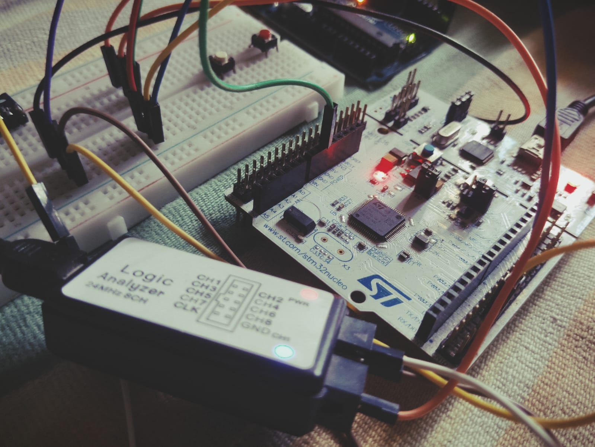
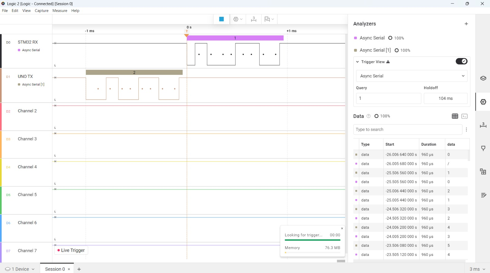

# UART Bit Banging

Software implementation of the UART communication protocol using **Arduino Uno (ATmega328P)** and **STM32 Nucleo-F446RE** without relying on dedicated hardware UART peripherals.

This project demonstrates how UART communication works at the bit level by manually generating and sampling UART frames using GPIO pins, software timing, and register-level programming.

---

# Project Structure

```text
UART/
│
├── Arduino/
│   ├── UART_BB/
│   └── UART_Bit_Bang_UNO/
│
├── ST/
│   ├── 01_UART_BB_TX/
│   └── 02_UART_BareMetal/
│
├── Images/
│
└── README.md
```

---

# Overview

This project contains software implementations of UART communication on both Arduino and STM32 platforms.

The implementation covers

- Software UART Transmission
- Software UART Reception
- GPIO Bit Manipulation
- Software Timing
- Register-Level Programming
- Logic Analyzer Validation

---

# Implementations

## Arduino

### UART_Bit_Bang_UNO

Complete software UART implementation on the Arduino Uno.

---

### UART_BB

UART transmitter application used to validate the STM32 software UART receiver.

---

## STM32 Nucleo-F446RE

### 01_UART_BB_TX (HAL)

Software UART transmitter implemented using HAL GPIO APIs.

### Features

- GPIO-Based UART Transmission
- Software Generated UART Frames
- DWT Cycle Counter Timing
- Logic Analyzer Validation

---

### 02_UART_BareMetal

Complete software UART implementation using register-level programming.

### Features

- Bare Metal GPIO Configuration
- Register-Level Programming
- DWT Cycle Counter Timing
- Software UART Transmission
- Software UART Reception
- PLL Configuration (84 MHz)
- Arduino ↔ STM32 Communication Testing

---

# UART Frame Format

```text
Idle | Start | D0 | D1 | D2 | D3 | D4 | D5 | D6 | D7 | Stop

HIGH |  LOW  |                Data                | HIGH
```

UART Configuration

```text
Baud Rate : 9600

Data Bits : 8

Parity : None

Stop Bits : 1
```

Frame Format

```text
8N1
```

---

# Hardware Used

- STM32 Nucleo-F446RE
- Arduino Uno (ATmega328P)
- Logic Analyzer
- Jumper Wires
- USB Cable

---

# Hardware Connections

## Arduino TX → STM32 RX

```text
Arduino D1 (TX)
        │
        ▼
STM32 PB13 (RX)

Arduino GND
        │
        ▼
STM32 GND
```

---

## STM32 TX → Logic Analyzer

```text
STM32 PB14 (TX)
        │
        ▼
Logic Analyzer
```

---

# Hardware Setup

### Arduino and STM32 Test Setup



---

### Logic Analyzer Output



---

# Validation

## Test 1

Arduino Software UART → Logic Analyzer

Verified

- Start Bit
- Stop Bit
- Data Bits
- Baud Rate Accuracy

---

## Test 2

STM32 HAL Software UART → Logic Analyzer

Verified

- UART Frame Structure
- Data Transmission
- Bit Timing

---

## Test 3

STM32 Bare-Metal Software UART → Logic Analyzer

Verified

- Register-Level GPIO Programming
- Accurate Bit Timing
- UART Frame Generation

---

## Test 4

Arduino TX → STM32 RX

Verified

- Start Bit Detection
- Mid-Bit Sampling
- Data Reconstruction

---

## Test 5

Arduino ↔ STM32 Software UART Communication

Verified

- Data Transmission
- Data Reception
- Software UART Interoperability

---

# Future Improvements

- Timer-Based Software UART
- Interrupt-Driven Reception
- Configurable Baud Rate
---