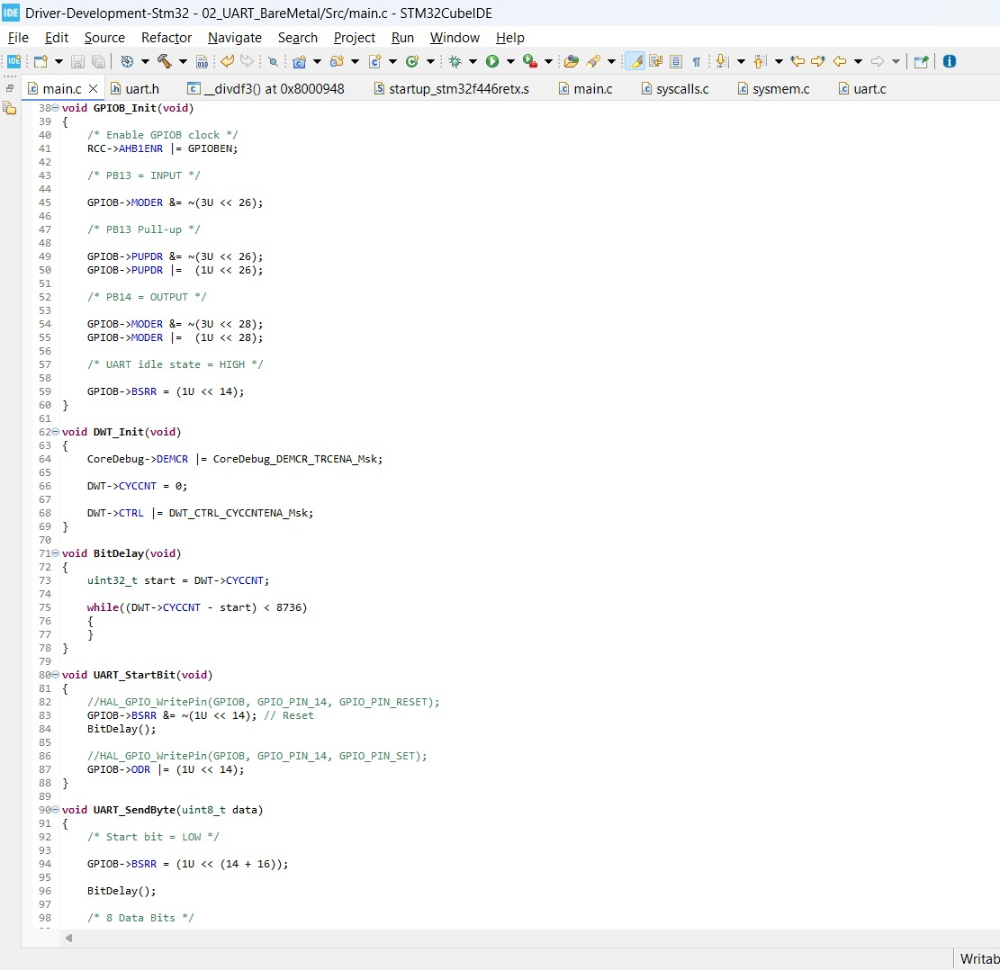

# UART Bit Banging

Software implementation of UART communication using **Arduino Uno (ATmega328P)** and **STM32 Nucleo-F446RE** without relying on dedicated hardware UART peripherals.

The goal of this repository is to understand UART communication at the bit level by manually generating and sampling UART frames using GPIO pins, software timing, and register-level programming.

---

# Repository Structure

```text
UART/
│
├── Arduino/
│   ├── UART_BB/
│   └── UART_Bit_Bang_UNO/
│
└── ST/
    ├── 01_UART_BB_TX/
    └── 02_UART_BareMetal/
```

---

# Projects

## Arduino

### UART_Bit_Bang_UNO

Software UART implementation on Arduino Uno.

### Features

- Software UART Transmission
- Software UART Reception
- Manual Start Bit Generation
- Manual Stop Bit Generation
- Bit Timing Control
- Logic Analyzer Validation

---

### UART_BB

UART transmitter application used to validate STM32 software UART implementations.

### Features

- UART Test Pattern Generation
- STM32 RX Validation
- Logic Analyzer Verification

---

## STM32 Nucleo-F446RE

### 01_UART_BB_TX (HAL)

UART transmission implemented using HAL GPIO APIs.

### Features

- GPIO Based UART Transmission
- Software Generated UART Frames
- DWT Cycle Counter Timing
- Logic Analyzer Validation

---

### 02_UART_BareMetal

Complete software UART implementation using register-level programming.

### Features

- Bare Metal GPIO Configuration
- Register-Level Programming
- DWT Cycle Counter Based Timing
- Software UART Transmission
- Software UART Reception
- PLL Based 84 MHz Clock Configuration
- Arduino ↔ STM32 Communication Testing

---

# UART Frame Format

```text
Idle | Start | D0 | D1 | D2 | D3 | D4 | D5 | D6 | D7 | Stop

HIGH |  LOW  |                Data                | HIGH
```

Configuration used:

```text
Baud Rate : 9600
Data Bits : 8
Parity    : None
Stop Bits : 1
```

UART Configuration:

```text
8N1
```

---

# Hardware Used

- STM32 Nucleo-F446RE
- Arduino Uno
- Logic Analyzer
- Jumper Wires
- USB Cables

---

# Test Setup

## Arduino TX → STM32 RX

```text
Arduino D1 (TX)  ---------->  STM32 PB13 (RX)

Arduino GND      ---------->  STM32 GND
```

## STM32 TX → Logic Analyzer

```text
STM32 PB14 (TX) ----------> Logic Analyzer
```

---

# Hardware Setup


---
### STM32 Bare Metal UART Bit-Banging



---

### UART Frame Captured Using Logic Analyzer


---
# Validation Performed

## Test 1

Arduino Software UART → Logic Analyzer

Verified:

- Start Bit
- Stop Bit
- Data Bits
- Baud Rate Accuracy

---

## Test 2

STM32 HAL Bit-Banged UART → Logic Analyzer

Verified:

- UART Frame Structure
- Data Transmission
- Bit Timing

---

## Test 3

STM32 Bare Metal UART → Logic Analyzer

Verified:

- Register Level GPIO Control
- Accurate Bit Timing
- UART Frame Generation

---

## Test 4

Arduino TX → STM32 RX

Verified:

- Start Bit Detection
- Bit Sampling
- Data Reconstruction

---

## Test 5

Arduino ↔ STM32 Communication

Verified:

- Data Transmission
- Data Reception
- Software UART Interoperability

---


---

# Key Learnings

- Difference between Hardware UART and Software UART
- UART Timing Requirements
- Importance of Mid-Bit Sampling
- System Clock Impact on Communication
- DWT Based Precise Delays
- Register-Level GPIO Programming
- UART Debugging using Logic Analyzer
- Bare Metal Firmware Development

---

# Future Improvements

- Timer Based Software UART
- Interrupt Driven Reception
- Configurable Baud Rate Support
- Driver Layer Abstraction
- Hardware UART Driver Development
- SPI Bit Banging
- I2C Bit Banging

---

# Author

**Matheshvarma**

Embedded Systems | Firmware Development | STM32 | Embedded C

GitHub: https://github.com/matheshembed
